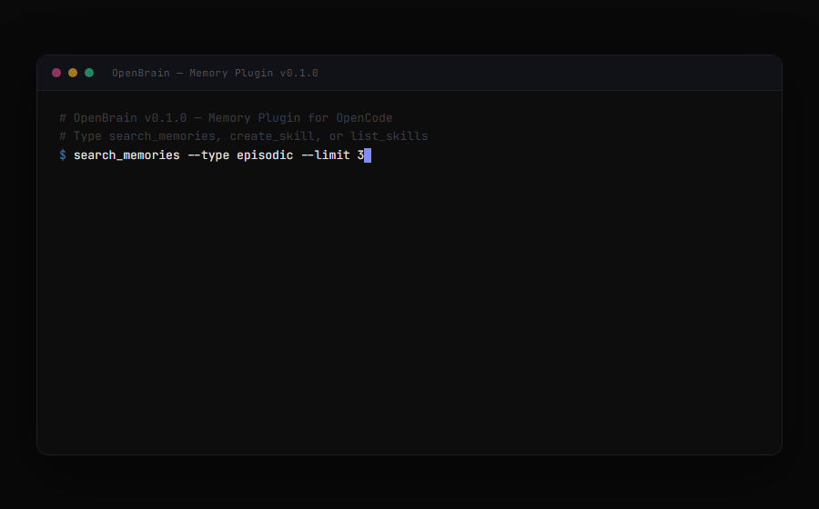
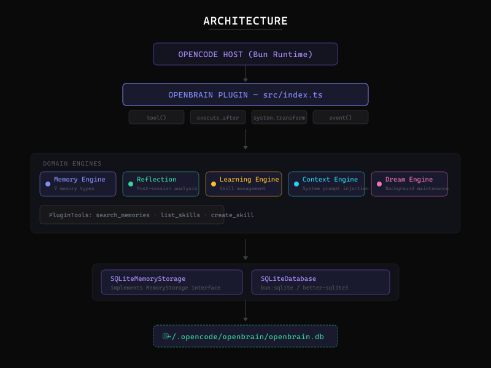
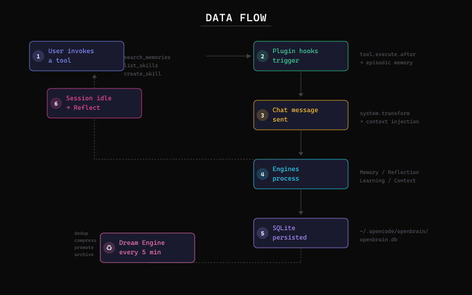
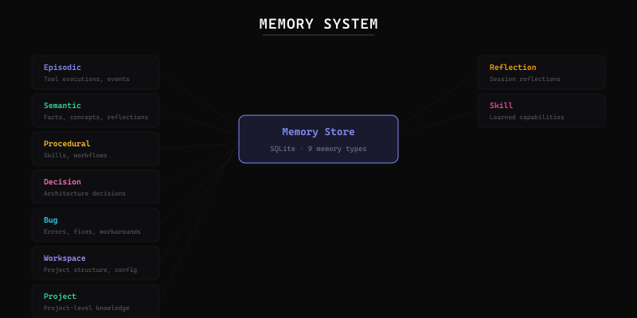
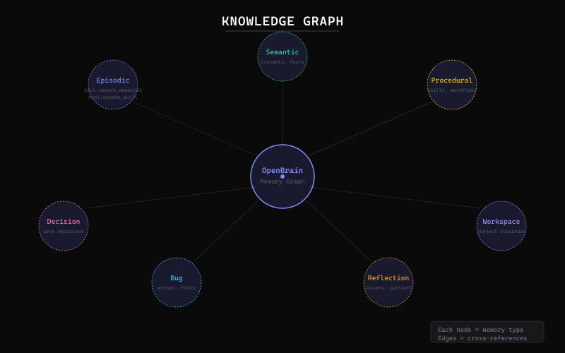

<p align="center">
  <picture>
    <source media="(prefers-color-scheme: dark)" srcset="media/wordmark.png">
    
  </picture>
</p>

<p align="center">
  Persistent memory, reflection &amp; learning for OpenCode AI
</p>

<p align="center">
  <a href="#features">Features</a> •
  <a href="#architecture">Architecture</a> •
  <a href="#installation">Installation</a> •
  <a href="#quick-start">Quick Start</a> •
  <a href="#api-reference">API</a>
</p>

<p align="center">
  
  
  
  
</p>

<br>

<p align="center">
  
</p>

<br>

OpenBrain is a memory plugin for [OpenCode](https://opencode.ai) that gives your AI assistant persistent, cross-session memory. It records tool executions as episodic memories, reflects on sessions to extract insights, learns reusable skills from repeated patterns, and injects relevant context into every conversation — so OpenCode never forgets what it learned.

Unlike stateless AI sessions, OpenBrain maintains a SQLite-backed memory store with 9 typed memory systems, 5 domain engines, and automatic background maintenance. Every tool call, every decision, every bug fix becomes a durable record that improves future interactions.

---

## Features

**Typed Memory System** — 9 distinct memory types (Episodic, Semantic, Procedural, Decision, Bug, Workspace, Project, Reflection, Skill), each with typed metadata. Memories carry confidence scores and tags for precise retrieval.

**Three Plugin Tools** — `search_memories` to query memory by content, type, or tags; `create_skill` to define reusable workflows with prompts and steps; `list_skills` to review learned capabilities.

**Automatic Context Injection** — Before every chat, OpenBrain gathers relevant memories, available skills, and user preferences, then appends them to the system prompt. The AI always knows what came before.

**Reflection Engine** — When a session goes idle, OpenBrain analyzes the session and persists mistakes, lessons, patterns, anti-patterns, decisions, and user preferences as semantic memories.

**Learning Engine** — Skills are cached in memory and persisted to SQLite. Each skill tracks usage count and success rate. Failed skills are demoted; reliable skills float to the top.

**Dream Engine (Background Maintenance)** — Every 5 minutes, OpenBrain deduplicates memories (keeps highest confidence), compresses old memories (>1 week), promotes high-confidence memories (>=0.95), and archives stale records (>1 month). No manual cleanup needed.

**Dual SQLite Runtime** — Uses `bun:sqlite` when running on Bun (OpenCode's native runtime) and falls back to `better-sqlite3` on Node.js.

---

## Architecture

```
OpenCode Host (Bun)
  └─ OpenBrain Plugin (src/index.ts)
       ├─ Plugin Hooks: tool · execute.after · system.transform · event
       ├─ Domain Engines
       │   ├─ MemoryEngine   — 7 typed memory CRUD
       │   ├─ ReflectionEngine — Post-session analysis
       │   ├─ LearningEngine — Skill management
       │   ├─ ContextEngine  — System prompt injection
       │   └─ DreamEngine    — Background maintenance
       ├─ PluginTools
       │   ├─ search_memories
       │   ├─ list_skills
       │   └─ create_skill
       └─ Data Layer
            ├─ SQLiteMemoryStorage — Interface implementation
            └─ SQLiteDatabase — bun:sqlite / better-sqlite3
```



### Data Flow

1. **Tool Execution** — User invokes a tool → recorded as episodic memory
2. **Chat Message** — Before response, context engine injects memories + skills into system prompt
3. **Session Idle** — Reflection engine extracts insights, patterns, preferences
4. **Background** — Dream engine deduplicates, compresses, promotes, archives



---

## Why This Exists

OpenCode is a powerful AI coding assistant, but like all LLMs, it has no persistent memory across sessions. Every new conversation starts from zero — no context about your project, your preferences, your past decisions, or the bugs you've already fixed.

OpenBrain solves this by acting as a long-term memory layer. It's not a vector database. It's not a RAG system. It's a structured, typed memory engine designed specifically for the OpenCode plugin architecture. It remembers:

- Every tool you've executed and its result
- Architectural decisions and why they were made
- Bugs you've encountered and how they were fixed
- Skills you've developed and how reliable they are
- Your project structure and workspace layout
- Patterns in your workflow and anti-patterns to avoid
- Preferences about how you like things done

This means OpenCode becomes more useful the longer you use it. The AI learns from experience, just like a human developer.

---

## Installation

OpenBrain is an OpenCode plugin. Install it by adding it to your `opencode.json`:

```json
{
  "plugin": ["path/to/openbrain"]
}
```

Then install dependencies and build:

```bash
cd path/to/openbrain
npm install
npm run build
```

The plugin requires OpenCode >= 1.18.0 and runs on Bun (OpenCode's native runtime). It works on macOS, Linux, and Windows.

---

## Quick Start

Once installed and configured, OpenBrain activates automatically when OpenCode starts. Use these tools in your OpenCode conversations:

**Search memories:**
```
search_memories --query "database schema" --type semantic --limit 5
```

**Create a reusable skill:**
```
create_skill --name "debug-node-error" \
  --description "Steps to debug Node.js errors" \
  --prompt "When you see a Node.js error, check the stack trace..." \
  --steps "Read stack trace" "Check node_modules" "Verify Node version"
```

**List learned skills:**
```
list_skills
```

OpenBrain also logs every tool execution as an episodic memory automatically — no explicit action required.

---

## Configuration

OpenBrain stores its data at `~/.opencode/openbrain/openbrain.db`. The database is created automatically on first launch.

The Dream Engine maintenance interval defaults to 5 minutes (300,000 ms). To configure, modify the `start()` call in your plugin setup:

```ts
dreamEngine.start(intervalMs);
```

Memory compression occurs on records older than 7 days. Archival occurs on records older than 30 days. Promotion activates at confidence >= 0.95.

---

## Example Workflow

```
$ search_memories --type decision --query "why chose sqlite"
┌──────────────────────────────────────────────┐
│ ID: mem_x1y2z3                              │
│ Type: Decision                              │
│ Content: Chose SQLite over PostgreSQL for    │
│          local-first architecture            │
│ Confidence: 0.92                            │
│ Tags: architecture, database, decision       │
└──────────────────────────────────────────────┘

$ create_skill --name "sqlite-migration" \
  --description "How to create SQLite migrations" \
  --steps "Create migration file" "Run migration" "Verify"
✓ Skill 'sqlite-migration' created

$ list_skills
  1. debug-node       (success: 92%)
  2. review-pr        (success: 88%)
  3. write-test       (success: 95%)
  4. sqlite-migration (success: 100%)
```

---

## Memory Engine

The memory engine manages 9 memory types, each with typed metadata:

| Type | Metadata | Purpose |
|---|---|---|
| `Episodic` | `tool`, `args`, `timestamp` | Tool executions and events |
| `Semantic` | `concepts`, `facts` | Knowledge, concepts, reflections |
| `Procedural` | `steps`, `workflow` | Skills, procedures, workflows |
| `Decision` | `options`, `rationale` | Architecture decisions |
| `Bug` | `error`, `fix` | Errors, fixes, workarounds |
| `Workspace` | `project`, `config` | Project structure |
| `Project` | `name`, `description` | Project-level knowledge |
| `Reflection` | `sessionId` | Session analysis |
| `Skill` | `usageCount`, `successRate` | Learned capabilities |



---

## Reflection Engine

When a session goes idle, the Reflection Engine:

1. Creates a structured reflection record (mistakes, lessons, patterns, anti-patterns, decisions, user preferences, reusable workflows)
2. Stores each element as an individual semantic memory
3. Tags everything with `reflection` for easy retrieval

Reflections accumulate over time, building a progressively richer model of how you work.

---

## Knowledge Graph

Memories are not isolated — they form a graph. Episodic memories link to semantic memories. Decisions reference workspace context. Bugs connect to fixes. Skills build on procedures.



---

## Privacy

OpenBrain is fully local. All data lives in a SQLite database at `~/.opencode/openbrain/openbrain.db`. Nothing is sent to any external service. No telemetry. No analytics. No cloud dependencies.

The plugin only activates within OpenCode sessions. When OpenCode is closed, no background processes run.

---

## FAQ

**Does OpenBrain work without Bun?**  
Yes. It uses `bun:sqlite` when available and falls back to `better-sqlite3` on Node.js.

**Can I use OpenBrain with other AI assistants?**  
No. OpenBrain is designed specifically for the OpenCode plugin API.

**How much storage does it use?**  
Minimal. SQLite with WAL mode keeps the database compact. Old memories are compressed and archived automatically.

**Can I disable Dream Engine?**  
Not yet. Dream Engine starts automatically. A future release will add configuration toggles.

**Does it work on Windows?**  
Yes. All three platforms (macOS, Linux, Windows) are supported.

---

## Development

```bash
# Build
npm run build

# Watch mode
npm run dev

# Test
npm test

# Type check
npm run typecheck
```

Tests use vitest. Run `npm test` for the full suite.

---

## Roadmap

- Vector search integration (embedding-based memory retrieval)
- Configurable Dream Engine intervals and behaviors
- Memory export and import
- Multi-session reflection aggregation
- User preference learning refinement
- Plugin configuration UI

See [ROADMAP.md](ROADMAP.md) for details.

---

## Contributing

Contributions are welcome. See [CONTRIBUTING.md](CONTRIBUTING.md) for guidelines.

This project follows the [Contributor Covenant](CODE_OF_CONDUCT.md) code of conduct.

---

## License

MIT — see [LICENSE](LICENSE) for details.

---

<p align="center">
  <sub>Built for <a href="https://opencode.ai">OpenCode</a> · Memory is all you need</sub>
</p>
